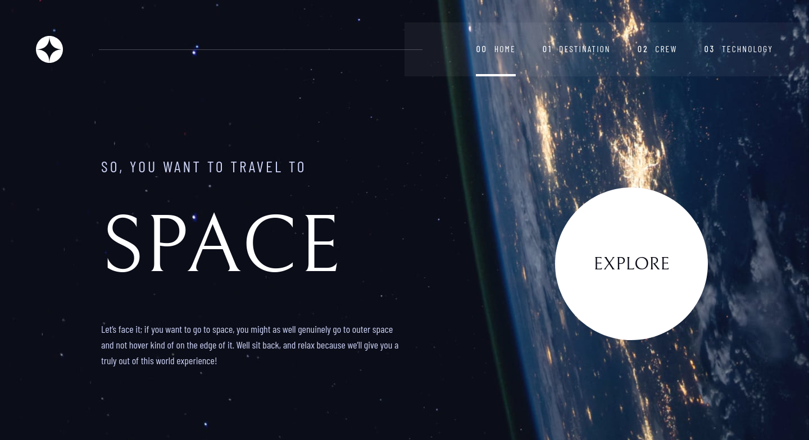
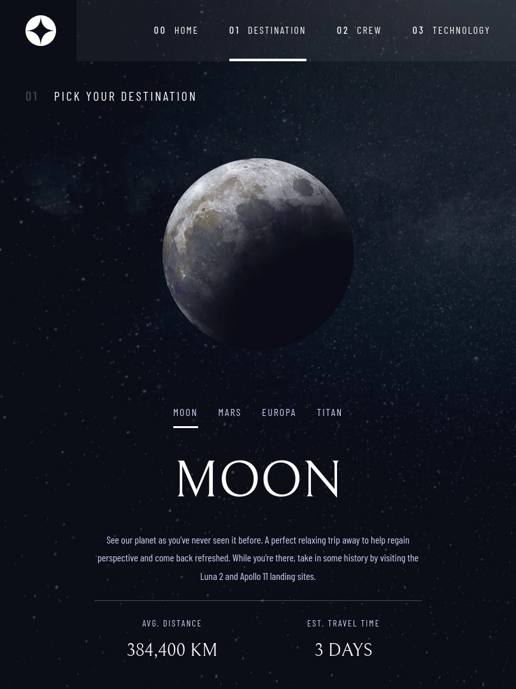
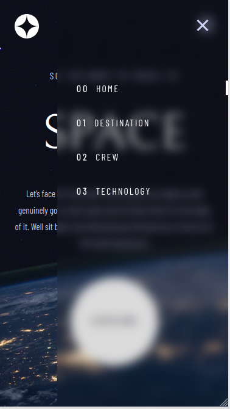

# Frontend Mentor - Space tourism website solution

This is a solution to the [Space tourism website challenge on Frontend Mentor](https://www.frontendmentor.io/challenges/space-tourism-multipage-website-gRWj1URZ3). 


### Links
- Solution URL: [Space Tourism Website Solution](https://github.com/garyeung/space-tourism-webisite)
- Live Site URL: [Space Tourism Website Live](https://space-tourism-webisite.vercel.app/)


### Built with

- [React](https://reactjs.org/) - JS library
- [Vite](https://vitejs.dev/)  - For development and building 
- [TailwindCSS](https://tailwindcss.com/) - CSS Framework
- [React Router](https://reactrouter.com/) - Routing

## Project Structure

```
/
├── public/              # Static assets
├── src/
│   ├── assets/          # Assets like images and fonts
│   ├── components/      # Reusable React components
│   │   ├── bases/       # Basic, single-purpose components
│   │   └── combinations/# Components composed of smaller components
│   ├── pages/           # Page components for each route
│   ├── services/        # Services like data fetching
│   ├── utils/           # Utility functions
│   ├── app.config.ts    # Main application configuration
│   ├── App.tsx          # Main App component
│   ├── data.json        # Data for the application
│   ├── index.css        # Global styles
│   ├── index.tsx        # Entry point of the application
│   └── routes.ts        # Route definitions
├── .gitignore
├── package.json
├── README.md
├── tailwind.config.js
└── vite.config.ts
```

## Getting Started

### Prerequisites

Make sure you have Node.js and npm installed on your machine.

### Installation

1. Clone the repo
   ```sh
   git clone https://github.com/garyeung/space-tourism-webisite.git
   ```
2. Install NPM packages
   ```sh
   npm install
   ```

### Running the application

To run the app in development mode:
```sh
npm run dev
```
This will open the app at `http://localhost:5173` (or another port if 5173 is in use).

To build the app for production:
```sh
npm run build
```

To preview the production build locally:
```sh
npm run preview
```


### Screenshot




